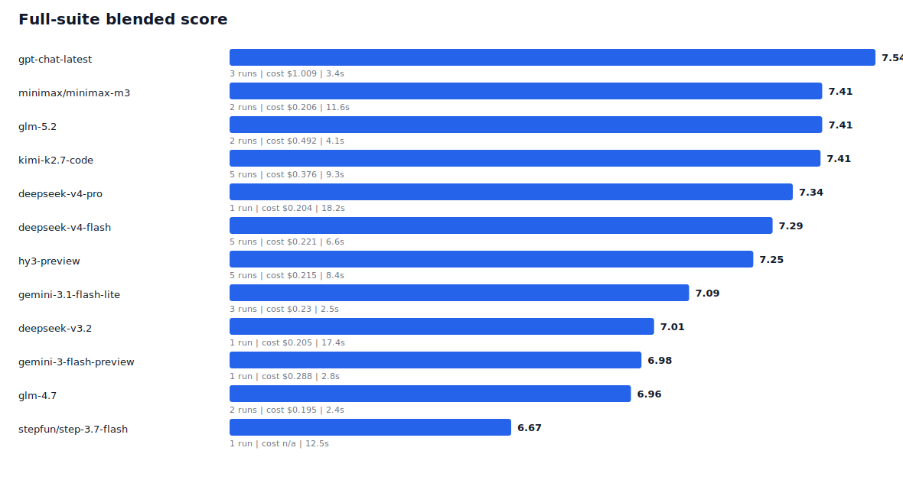
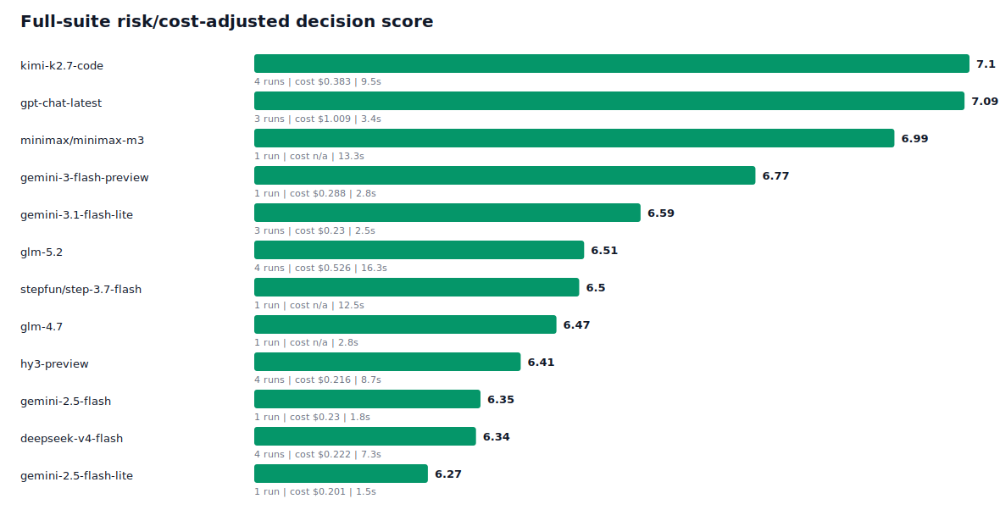
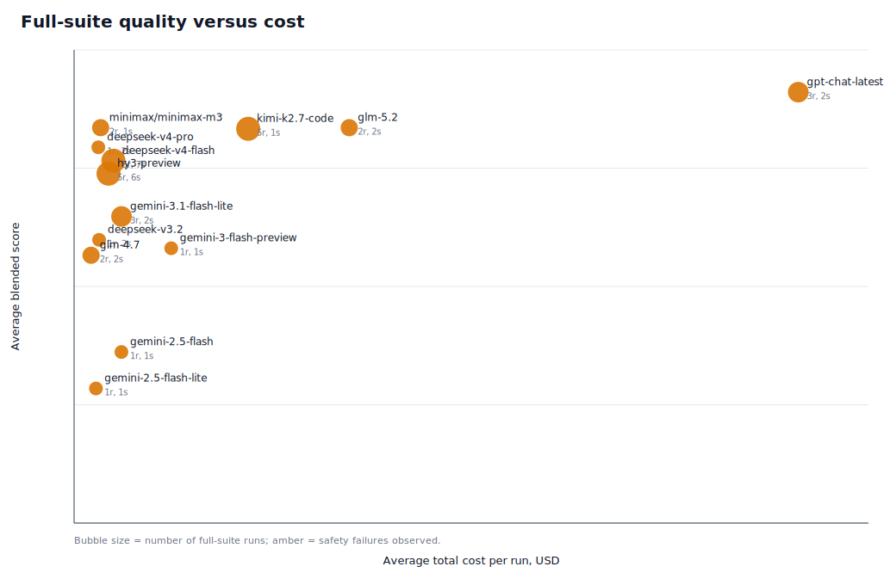
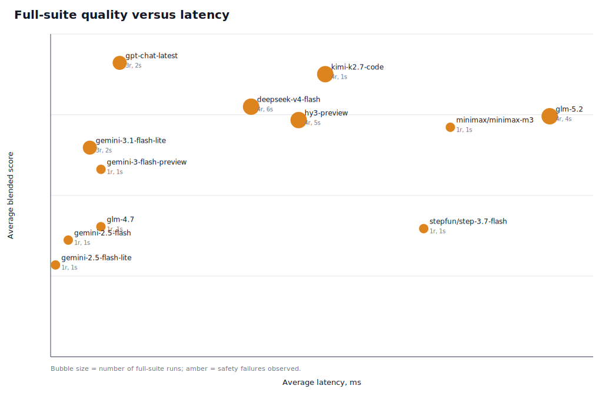

# Reality Benchmark Model Selection Plots

Generated on 2026-06-26 from judged JSON reports in `docs/benchmarks/runs`.

Primary selection uses full-suite runs only: `22` scenarios and `44` turns. Reduced-suite runs are listed separately as screening evidence.

`z-ai/glm-5.2` runs produced before explicit EU E2E/cost-aware OpenRouter routing are kept as historical evidence but excluded from the current decision ranking because provider routing was uncontrolled.

## Recommendation

- Best raw quality: `openai/gpt-chat-latest` with blended 7.54 across 3 full-suite run(s).
- Best risk/cost-adjusted pick: `minimax/minimax-m3` with decision score 7.11.
- Best value pick among models with recorded costs: `deepseek/deepseek-v4-pro` with 36.04 blended points per dollar/run.

The decision score is a lightweight operational score: blended score minus penalties for safety failures, judge disagreements, score volatility, and run cost. It is for model selection only; the source benchmark score remains the blended score.

## Plots

## Full-Suite Ranking

| Rank | Model | Runs | Blended | SD | Judge | Heuristic | Latency | Avg cost/run | Safety failures | Judge flags | Decision score |
|---:|---|---:|---:|---:|---:|---:|---:|---:|---:|---:|---:|
| 1 | `openai/gpt-chat-latest` | 3 | 7.54 | 0.07 | 7.91 | 6.68 | 3.4s | $1.009 | 2 | 5 | 7.09 |
| 2 | `minimax/minimax-m3` | 2 | 7.41 | 0.21 | 7.79 | 6.52 | 11.6s | $0.206 | 1 | 4 | 7.11 |
| 3 | `z-ai/glm-5.2` | 2 | 7.41 | 0.05 | 7.81 | 6.48 | 4.1s | $0.492 | 2 | 5 | 7 |
| 4 | `moonshotai/kimi-k2.7-code` | 5 | 7.41 | 0.23 | 7.75 | 6.6 | 9.3s | $0.376 | 1 | 12 | 6.96 |
| 5 | `deepseek/deepseek-v4-pro` | 1 | 7.34 | 0 | 7.78 | 6.33 | 18.2s | $0.204 | 2 | 4 | 6.99 |
| 6 | `deepseek/deepseek-v4-flash` | 5 | 7.29 | 0.08 | 7.7 | 6.33 | 6.6s | $0.221 | 7 | 13 | 6.18 |
| 7 | `tencent/hy3-preview` | 5 | 7.25 | 0.07 | 7.6 | 6.42 | 8.4s | $0.215 | 6 | 11 | 6.29 |
| 8 | `google/gemini-3.1-flash-lite` | 3 | 7.09 | 0.08 | 7.55 | 6.02 | 2.5s | $0.23 | 2 | 12 | 6.59 |
| 9 | `deepseek/deepseek-v3.2` | 1 | 7.01 | 0 | 7.4 | 6.09 | 17.4s | $0.205 | 2 | 4 | 6.66 |
| 10 | `google/gemini-3-flash-preview` | 1 | 6.98 | 0 | 7.35 | 6.12 | 2.8s | $0.288 | 1 | 2 | 6.77 |
| 11 | `z-ai/glm-4.7` | 2 | 6.96 | 0.28 | 7.26 | 6.25 | 2.4s | $0.195 | 2 | 9 | 6.44 |
| 12 | `stepfun/step-3.7-flash` | 1 | 6.67 | 0 | 6.92 | 6.07 | 12.5s | n/a | 1 | 0 | 6.5 |
| 13 | `google/gemini-2.5-flash` | 1 | 6.61 | 0 | 6.81 | 6.13 | 1.8s | $0.23 | 1 | 6 | 6.35 |
| 14 | `google/gemini-2.5-flash-lite` | 1 | 6.48 | 0 | 6.6 | 6.19 | 1.5s | $0.201 | 1 | 3 | 6.27 |

## Reduced-Suite Screening

These are not directly comparable with the full-suite table, but they indicate which models are worth promoting to full-suite runs.

| Rank | Model | Runs | Blended | SD | Judge | Heuristic | Latency | Avg cost/run | Safety failures | Judge flags | Decision score |
|---:|---|---:|---:|---:|---:|---:|---:|---:|---:|---:|---:|
| 1 | `moonshotai/kimi-k2.7-code` | 3 | 7.63 | 0.03 | 7.94 | 6.93 | 9.3s | $0.151 | 0 | 1 | 7.57 |
| 2 | `deepseek/deepseek-v4-pro` | 1 | 7.59 | 0 | 8.03 | 6.56 | 14.9s | n/a | 0 | 0 | 7.54 |
| 3 | `openai/gpt-chat-latest` | 3 | 7.52 | 0.03 | 7.81 | 6.82 | 3.1s | $0.396 | 0 | 2 | 7.41 |
| 4 | `deepseek/deepseek-v4-flash` | 2 | 7.49 | 0.22 | 7.81 | 6.74 | 10.5s | $0.085 | 0 | 2 | 7.36 |
| 5 | `deepseek/deepseek-v3.2` | 1 | 7.45 | 0 | 7.63 | 7.01 | 21.2s | n/a | 0 | 1 | 7.39 |
| 6 | `xiaomi/mimo-v2.5-pro` | 1 | 7.28 | 0 | 7.53 | 6.68 | 13.1s | n/a | 0 | 1 | 7.22 |
| 7 | `minimax/minimax-m3` | 2 | 7.16 | 0.11 | 7.66 | 5.99 | 11.9s | n/a | 0 | 2 | 7.04 |
| 8 | `z-ai/glm-4.7` | 2 | 7.12 | 0.17 | 7.43 | 6.38 | 5.1s | n/a | 1 | 2 | 6.85 |
| 9 | `xiaomi/mimo-v2.5` | 1 | 6.84 | 0 | 6.93 | 6.64 | 8.5s | n/a | 0 | 2 | 6.76 |
| 10 | `stepfun/step-3.7-flash` | 1 | 6.4 | 0 | 6.77 | 5.53 | 18.7s | n/a | 1 | 0 | 6.23 |

## Excluded Historical Runs

| Model | Suite | File | Blended | Latency | Cost | Reason |
|---|---|---|---:|---:|---:|---|
| `z-ai/glm-5.2` | full | `reality-2026-06-26-eu-provider-wide-run-candidates-judged.json` | 7.29 | 4s | $0.508 | legacy/uncontrolled-provider-routing |
| `z-ai/glm-5.2` | full | `reality-2026-06-19-stability-rerun-4-model-costed.json` | 7.44 | 13.8s | $0.547 | legacy/uncontrolled-provider-routing |
| `z-ai/glm-5.2` | full | `reality-2026-06-17-model-comparison-rerun.json` | 7.02 | 17.4s | n/a | legacy/uncontrolled-provider-routing |
| `z-ai/glm-5.2` | reduced | `reality-2026-06-17-reduced-4-model-costed.json` | 7.48 | 18.1s | $0.191 | legacy/uncontrolled-provider-routing |
| `z-ai/glm-5.2` | reduced | `reality-2026-06-17-reduced-10-model-comparison-judged.json` | 7.86 | 18.2s | n/a | legacy/uncontrolled-provider-routing |
| `z-ai/glm-5.2` | full | `reality-2026-06-19-stability-rerun-4-model-costed-2.json` | 7.35 | 17.3s | $0.531 | legacy/uncontrolled-provider-routing |
| `z-ai/glm-5.2` | reduced | `reality-2026-06-17-model-comparison-judged.json` | 7.27 | 18.2s | n/a | legacy/uncontrolled-provider-routing |
| `z-ai/glm-5.2` | full | `reality-2026-06-18-full-4-model-costed.json` | 7.22 | 16.5s | $0.5 | legacy/uncontrolled-provider-routing |
| `z-ai/glm-5.2` | full | `reality-2026-06-26-glm-5-2-provider-rerun-1.json` | 7.35 | 18.5s | $0.506 | legacy/uncontrolled-provider-routing |

## Generated Artifacts

- `docs/benchmarks/model-selection-2026-06-26.csv`
- `docs/benchmarks/plots/2026-06-26/full-suite-blended-ranking.svg`
- `docs/benchmarks/plots/2026-06-26/full-suite-decision-score.svg`
- `docs/benchmarks/plots/2026-06-26/full-suite-score-vs-cost.svg`
- `docs/benchmarks/plots/2026-06-26/full-suite-score-vs-latency.svg`
