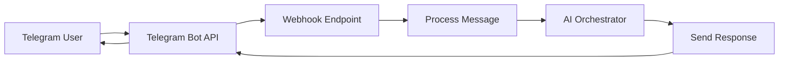
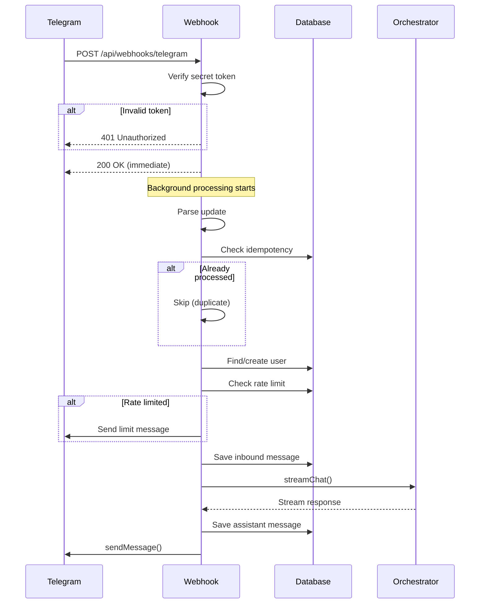
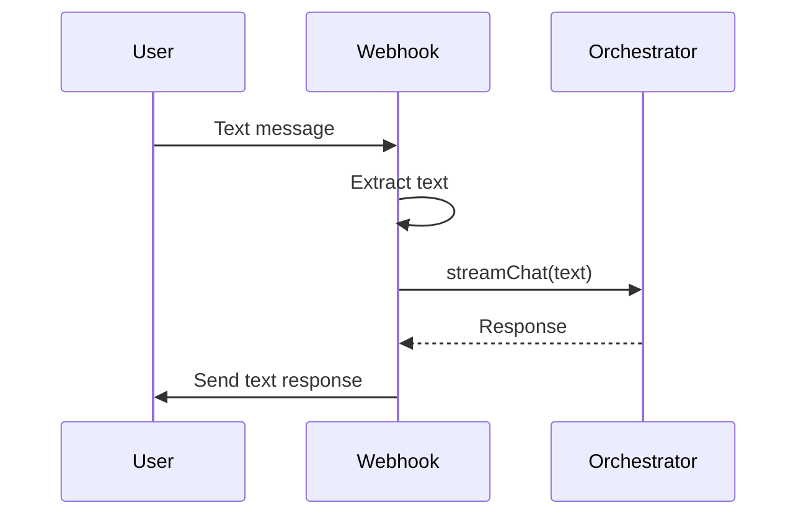
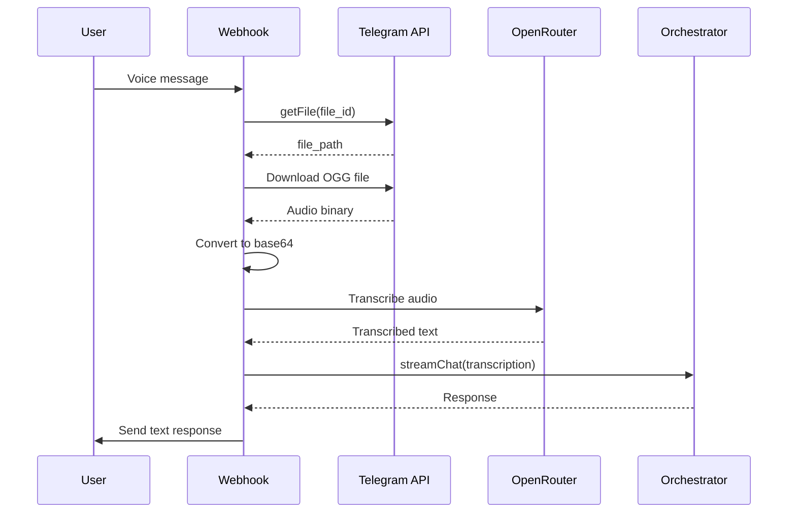
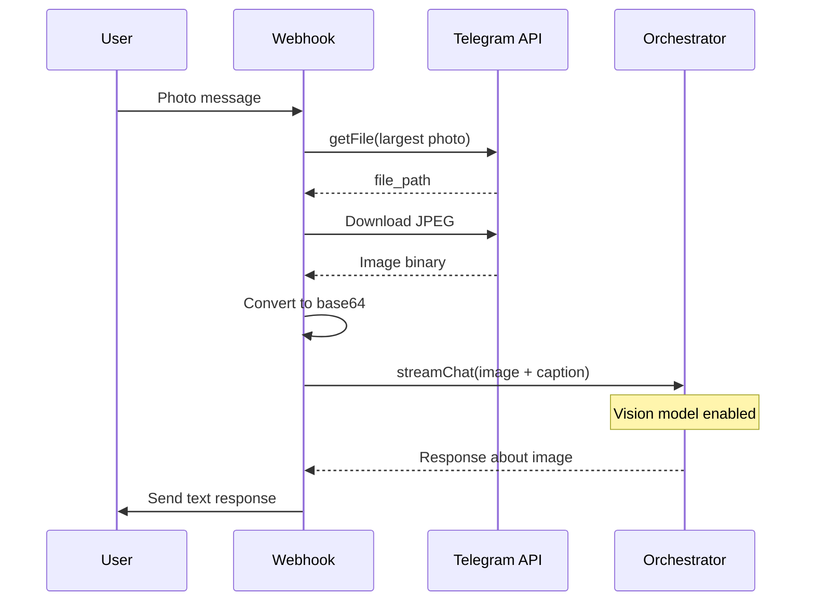
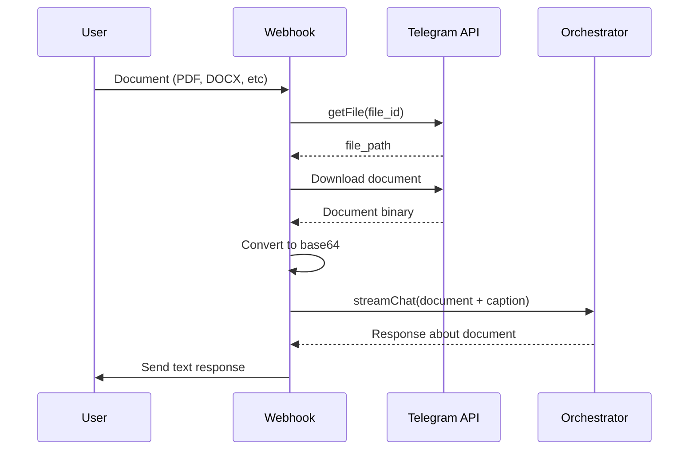
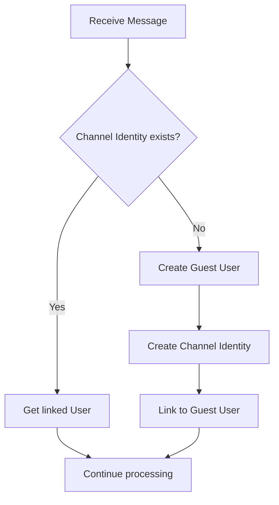
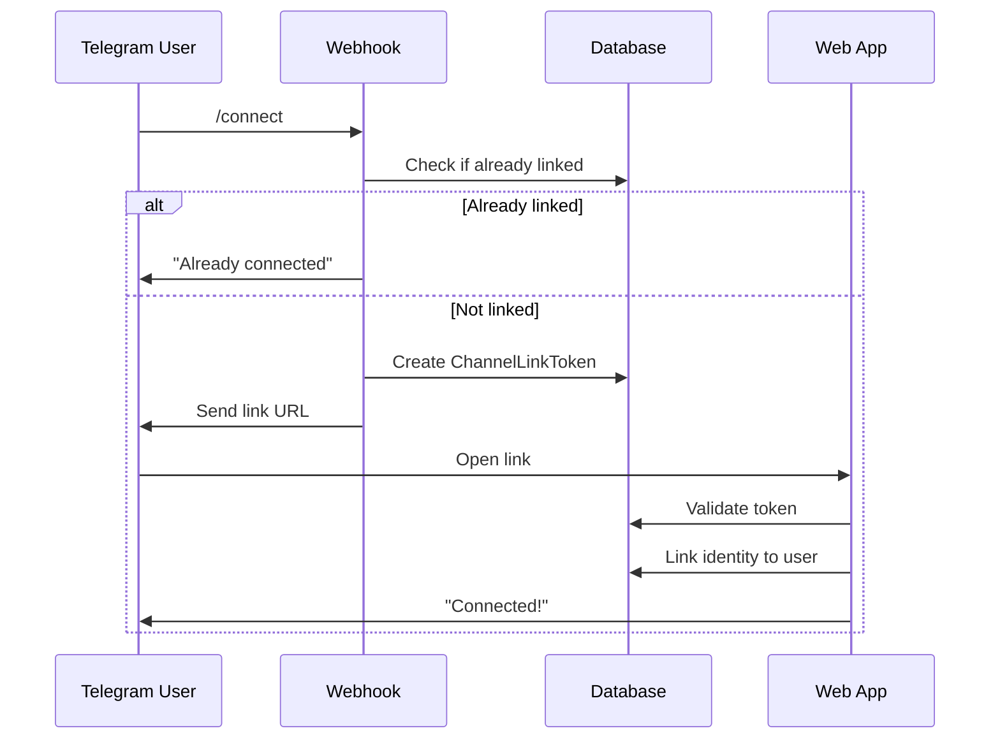
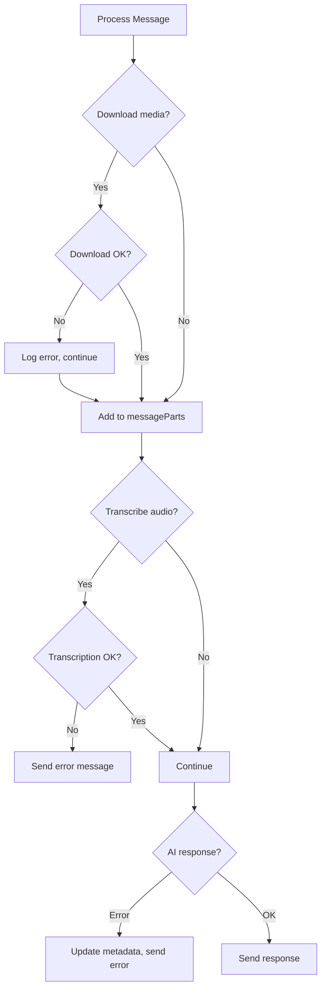

# Telegram Webhook

Complete documentation of the Telegram Bot webhook integration, covering message handling, media processing, user management, and AI integration.

## Overview

The Telegram webhook receives updates from the Telegram Bot API, processes user messages (text, voice, photos, documents), and generates AI responses using the orchestrator.



## Endpoint

| Method | Path                     | Description               |
| ------ | ------------------------ | ------------------------- |
| `POST` | `/api/webhooks/telegram` | Receives Telegram updates |
| `GET`  | `/api/webhooks/telegram` | Health check              |

### Authentication

The webhook requires a secret token in the header:

```
x-telegram-bot-api-secret-token: <TELEGRAM_WEBHOOK_SECRET>
```

## Message Flow

### Complete Request Lifecycle



## Message Types

### Text Messages



### Voice/Audio Messages



### Photo Messages



### Document Messages



## User Management

### User Resolution Flow



### Account Linking (`/connect` command)



## Data Structures

### TelegramUpdate

```typescript
type TelegramUpdate = {
	update_id: number;
	message?: {
		message_id: number;
		date: number;
		text?: string;
		caption?: string;
		voice?: TelegramVoice;
		audio?: TelegramAudio;
		photo?: TelegramPhotoSize[];
		document?: TelegramDocument;
		from?: {
			id: number;
			is_bot: boolean;
			first_name?: string;
			username?: string;
			language_code?: string;
		};
		chat?: {
			id: number;
			type: string;
		};
	};
};
```

### Message Types

| Type       | Condition           | Processing           |
| ---------- | ------------------- | -------------------- |
| `TEXT`     | Only text present   | Direct to AI         |
| `AUDIO`    | voice/audio present | Transcribe → AI      |
| `IMAGE`    | photo present       | Download → Vision AI |
| `DOCUMENT` | document present    | Download → AI        |

## Environment Variables

| Variable                  | Required | Description                      |
| ------------------------- | -------- | -------------------------------- |
| `TELEGRAM_BOT_TOKEN`      | Yes      | Bot token from BotFather         |
| `TELEGRAM_WEBHOOK_SECRET` | Yes      | Secret for webhook verification  |
| `OPENROUTER_API_KEY`      | Yes      | For AI responses & transcription |
| `TELEGRAM_SYNC_WEBHOOK`   | No       | Run synchronously (dev mode)     |
| `TELEGRAM_DISABLE_AI`     | No       | Disable AI responses             |
| `TELEGRAM_DISABLE_SEND`   | No       | Disable sending messages         |

## Error Handling



## Rate Limiting

-   Guest users: Stricter limits
-   Registered users: Based on subscription plan
-   When limited: Sends message asking to register

## Webhook Setup

```bash
# Set webhook URL
curl -X POST "https://api.telegram.org/bot<TOKEN>/setWebhook" \
  -H "Content-Type: application/json" \
  -d '{
    "url": "https://your-domain.com/api/webhooks/telegram",
    "secret_token": "<TELEGRAM_WEBHOOK_SECRET>"
  }'
```

## Related Files

-   [route.ts](file:///Users/kovd3v/Documents/Projects/anthon-2.0/src/app/api/webhooks/telegram/route.ts) - Webhook handler
-   [orchestrator.ts](file:///Users/kovd3v/Documents/Projects/anthon-2.0/src/lib/ai/orchestrator.ts) - AI response generation
-   [api.md](./api.md) - API documentation
