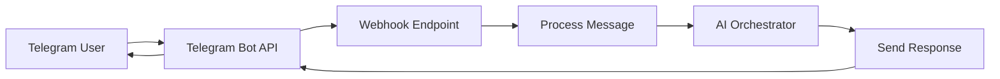
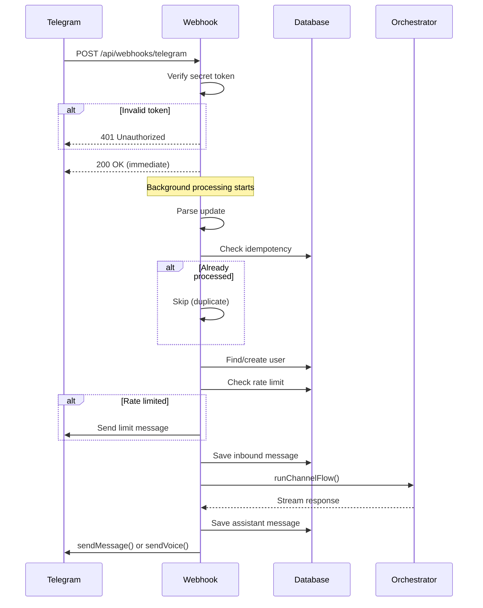
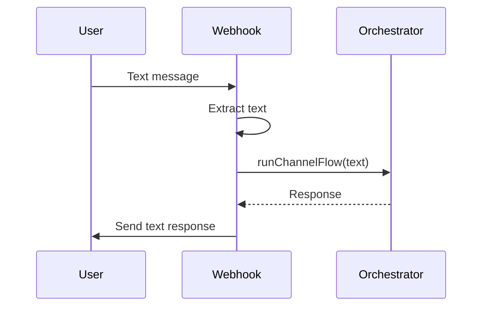
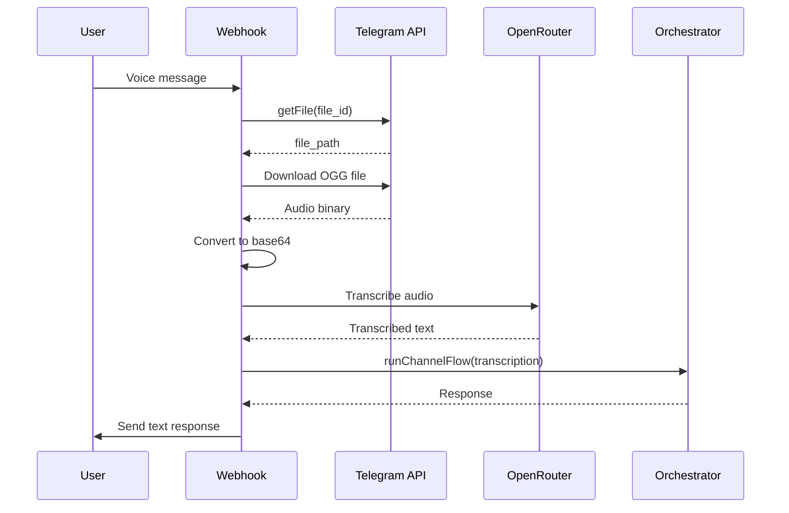
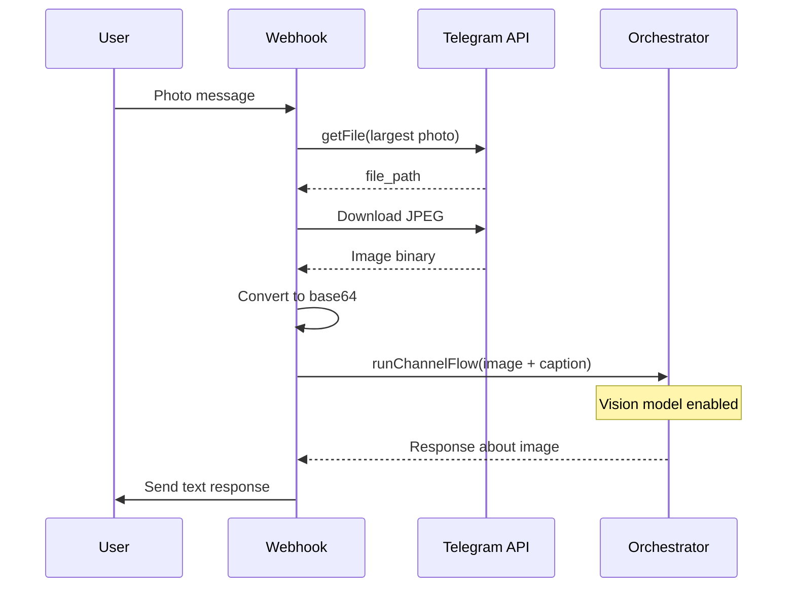
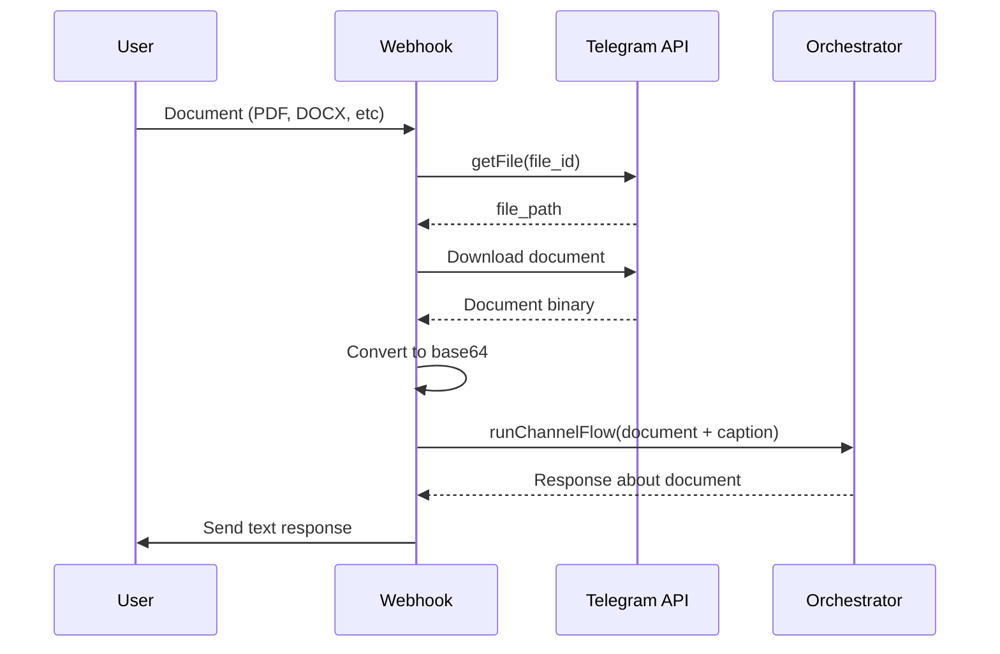
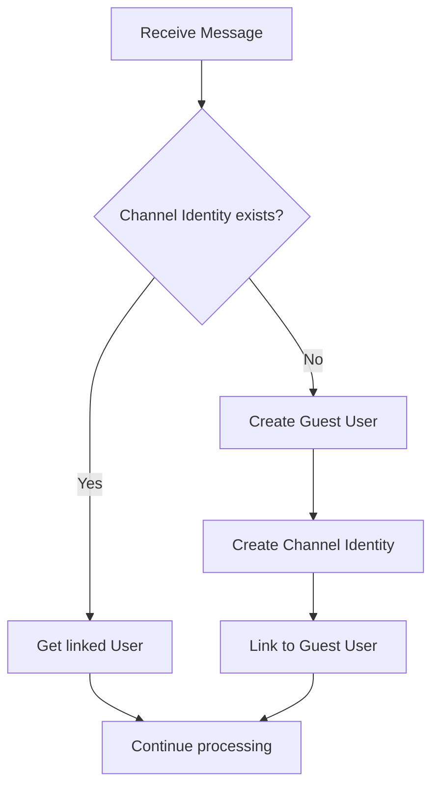
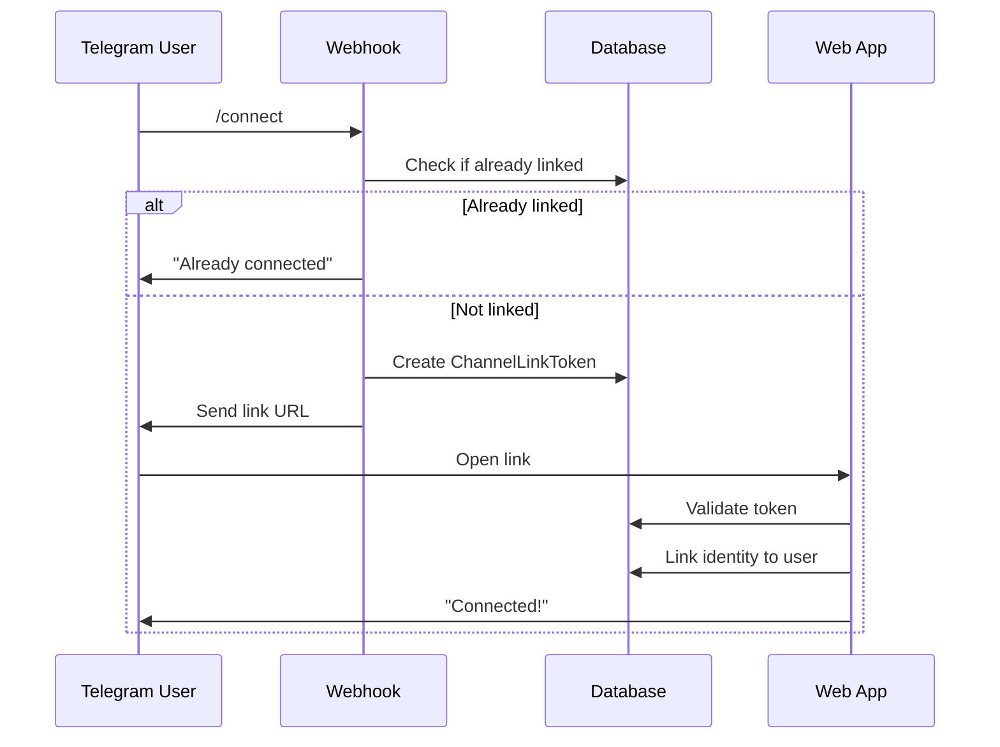
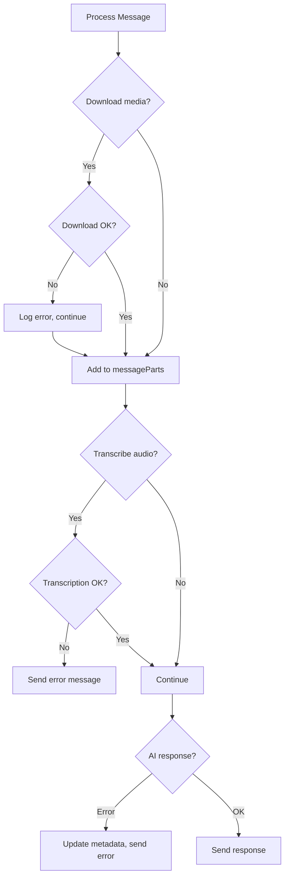

# Telegram Webhook

Complete documentation of the Telegram Bot webhook integration, covering message handling, media processing, user management, and AI integration.

## Overview

The Telegram webhook receives updates from the Telegram Bot API, processes user messages (text, voice, photos, documents), and delegates generation/persistence to the shared `runChannelFlow()` runtime.


```mermaid
flowchart LR
    A[Telegram User] --> B[Telegram Bot API]
    B --> C[Webhook Endpoint]
    C --> D[Process Message]
    D --> E[AI Orchestrator]
    E --> F[Send Response]
    F --> B
    B --> A
```

## Endpoint

| Method | Path                     | Description               |
| ------ | ------------------------ | ------------------------- |
| `POST` | `/api/webhooks/telegram` | Receives Telegram updates |
| `GET`  | `/api/webhooks/telegram` | Health check              |

### Authentication

The webhook requires a secret token in the header:

```
x-telegram-bot-api-secret-token: <TELEGRAM_WEBHOOK_SECRET>
```

## Message Flow

### Complete Request Lifecycle


```mermaid
sequenceDiagram
    participant TG as Telegram
    participant WH as Webhook
    participant DB as Database
    participant AI as Orchestrator

    TG->>WH: POST /api/webhooks/telegram
    WH->>WH: Verify secret token

    alt Invalid token
        WH-->>TG: 401 Unauthorized
    end

    WH-->>TG: 200 OK (immediate)

    Note over WH: Background processing starts

    WH->>WH: Parse update
    WH->>DB: Check idempotency

    alt Already processed
        WH->>WH: Skip (duplicate)
    end

    WH->>DB: Find/create user
    WH->>DB: Check rate limit

    alt Rate limited
        WH->>TG: Send limit message
    end

    WH->>DB: Save inbound message
    WH->>AI: runChannelFlow()
    AI-->>WH: Stream response
    WH->>DB: Save assistant message
    WH->>TG: sendMessage() or sendVoice()
```

## Message Types

### Text Messages


```mermaid
sequenceDiagram
    participant U as User
    participant WH as Webhook
    participant AI as Orchestrator

    U->>WH: Text message
    WH->>WH: Extract text
    WH->>AI: runChannelFlow(text)
    AI-->>WH: Response
    WH->>U: Send text response
```

### Voice/Audio Messages


```mermaid
sequenceDiagram
    participant U as User
    participant WH as Webhook
    participant TG as Telegram API
    participant TR as OpenRouter
    participant AI as Orchestrator

    U->>WH: Voice message
    WH->>TG: getFile(file_id)
    TG-->>WH: file_path
    WH->>TG: Download OGG file
    TG-->>WH: Audio binary
    WH->>WH: Convert to base64
    WH->>TR: Transcribe audio
    TR-->>WH: Transcribed text
    WH->>AI: runChannelFlow(transcription)
    AI-->>WH: Response
    WH->>U: Send text response
```

### Photo Messages


```mermaid
sequenceDiagram
    participant U as User
    participant WH as Webhook
    participant TG as Telegram API
    participant AI as Orchestrator

    U->>WH: Photo message
    WH->>TG: getFile(largest photo)
    TG-->>WH: file_path
    WH->>TG: Download JPEG
    TG-->>WH: Image binary
    WH->>WH: Convert to base64
    WH->>AI: runChannelFlow(image + caption)
    Note over AI: Vision model enabled
    AI-->>WH: Response about image
    WH->>U: Send text response
```

### Document Messages


```mermaid
sequenceDiagram
    participant U as User
    participant WH as Webhook
    participant TG as Telegram API
    participant AI as Orchestrator

    U->>WH: Document (PDF, DOCX, etc)
    WH->>TG: getFile(file_id)
    TG-->>WH: file_path
    WH->>TG: Download document
    TG-->>WH: Document binary
    WH->>WH: Convert to base64
    WH->>AI: runChannelFlow(document + caption)
    AI-->>WH: Response about document
    WH->>U: Send text response
```

### Generated Voice Responses

When ElevenLabs is configured and the personal plan/voice funnel allows it, the handler can synthesize the assistant text and send a Telegram voice response. Organization-selected entitlements are not passed to the current voice-policy call. Otherwise the handler sends text. Voice generation is separate from inbound audio transcription.

## User Management

### User Resolution Flow


```mermaid
flowchart TD
    A[Receive Message] --> B{Channel Identity exists?}
    B -->|Yes| C[Get linked User]
    B -->|No| D[Create Guest User]
    D --> E[Create Channel Identity]
    E --> F[Link to Guest User]
    C --> G[Continue processing]
    F --> G
```

### Account Linking (`/connect` command)


```mermaid
sequenceDiagram
    participant U as Telegram User
    participant WH as Webhook
    participant DB as Database
    participant Web as Web App

    U->>WH: /connect
    WH->>DB: Check if already linked

    alt Already linked
        WH->>U: "Already connected"
    else Not linked
        WH->>DB: Create ChannelLinkToken
        WH->>U: Send link URL
        U->>Web: Open link
        Web->>DB: Validate token
        Web->>DB: Link identity to user
        Web->>U: "Connected!"
    end
```

## Data Structures

### TelegramUpdate

```typescript
type TelegramUpdate = {
	update_id: number;
	message?: {
		message_id: number;
		date: number;
		text?: string;
		caption?: string;
		voice?: TelegramVoice;
		audio?: TelegramAudio;
		photo?: TelegramPhotoSize[];
		document?: TelegramDocument;
		from?: {
			id: number;
			is_bot: boolean;
			first_name?: string;
			username?: string;
			language_code?: string;
		};
		chat?: {
			id: number;
			type: string;
		};
	};
};
```

### Message Types

| Type       | Condition           | Processing           |
| ---------- | ------------------- | -------------------- |
| `TEXT`     | Only text present   | Direct to AI         |
| `AUDIO`    | voice/audio present | Transcribe → AI      |
| `IMAGE`    | photo present       | Download → Vision AI |
| `DOCUMENT` | document present    | Download → AI        |

## Environment Variables

| Variable                  | Required | Description |
| ------------------------- | -------- | ----------- |
| `TELEGRAM_BOT_TOKEN`      | Yes      | Bot API access and outbound delivery. |
| `TELEGRAM_BOT_USERNAME`   | For complete linking UX | Bot deep link used after link completion. |
| `TELEGRAM_WEBHOOK_SECRET` | Yes      | Secret-header verification. |
| `NEXT_PUBLIC_APP_URL`     | Yes for linking | Public base URL for `/link/telegram/[token]`. |
| `OPENROUTER_API_KEY`      | Yes for AI/media | Responses and audio transcription. |
| `ELEVENLABS_API_KEY`      | No       | Enables eligible generated voice replies. |
| `ELEVENLABS_VOICE_ID`     | No       | Overrides the default voice. |
| `TELEGRAM_SYNC_WEBHOOK`   | No       | Set `true` to await processing in local debugging. |
| `TELEGRAM_DISABLE_AI`     | No       | Set `true` to disable AI responses. |
| `TELEGRAM_DISABLE_SEND`   | No       | Set `true` to suppress outbound calls. |

Normal AI execution also requires Tavily and server-side PostHog configuration. See [Configuration](./configuration.md).

## Error Handling


```mermaid
flowchart TD
    A[Process Message] --> B{Download media?}
    B -->|Yes| C{Download OK?}
    C -->|No| D[Log error, continue]
    C -->|Yes| E[Add to messageParts]
    B -->|No| E
    E --> F{Transcribe audio?}
    F -->|Yes| G{Transcription OK?}
    G -->|No| H[Send error message]
    G -->|Yes| I[Continue]
    F -->|No| I
    I --> J{AI response?}
    J -->|Error| K[Update metadata, send error]
    J -->|OK| L[Send response]
    D --> E
```

## Rate Limiting

- Guest users use the guest plan and receive registration-oriented limit messaging.
- Registered users use the strongest personal/organization AI entitlement and receive the applicable upgrade/pricing message when limited.

## Webhook Setup

```bash
# Set webhook URL
curl -X POST "https://api.telegram.org/bot<TOKEN>/setWebhook" \
  -H "Content-Type: application/json" \
  -d '{
    "url": "https://your-domain.com/api/webhooks/telegram",
    "secret_token": "<TELEGRAM_WEBHOOK_SECRET>"
  }'
```

## Related Files

-   `src/app/api/webhooks/telegram/route.ts` - Route wrapper
-   `src/lib/channels/telegram/webhook-handler.ts` - Telegram adapter
-   `src/lib/channel-flow/` - Shared generation and assistant persistence
-   `src/lib/ai/orchestrator.ts` - AI response generation
-   [api.md](./api.md) - API documentation
