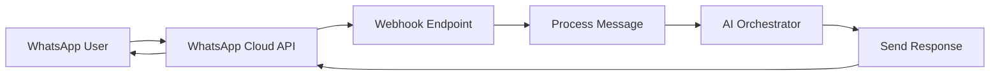
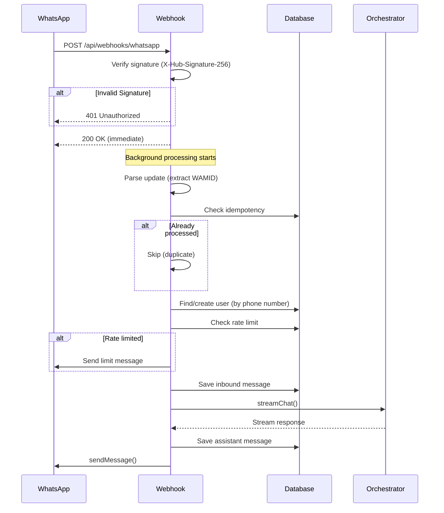
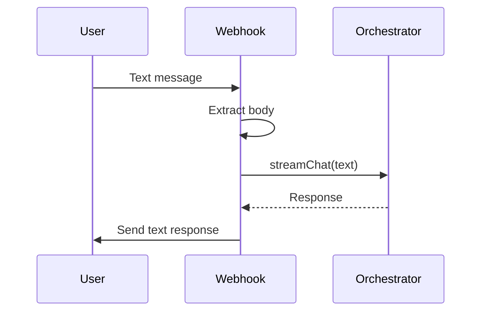
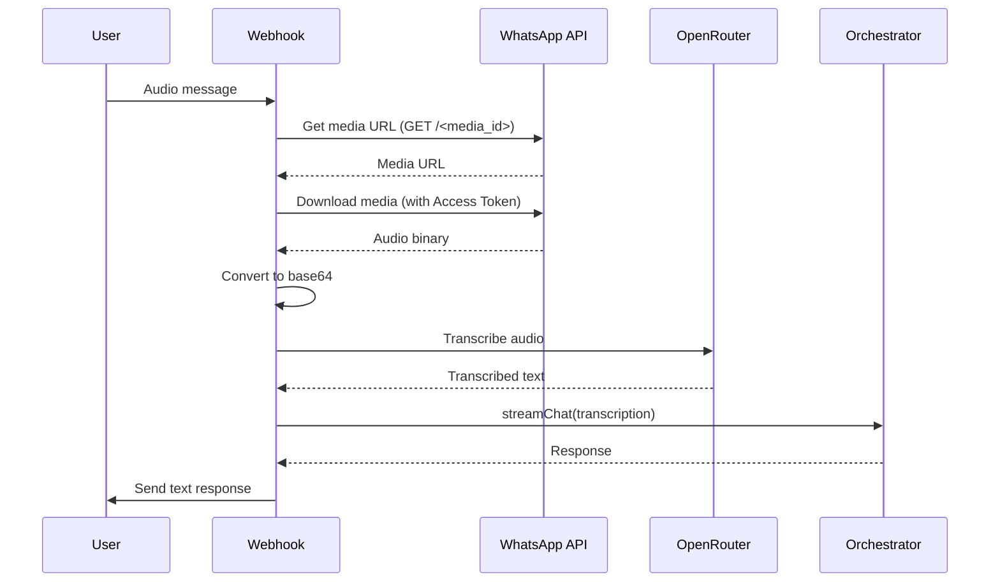
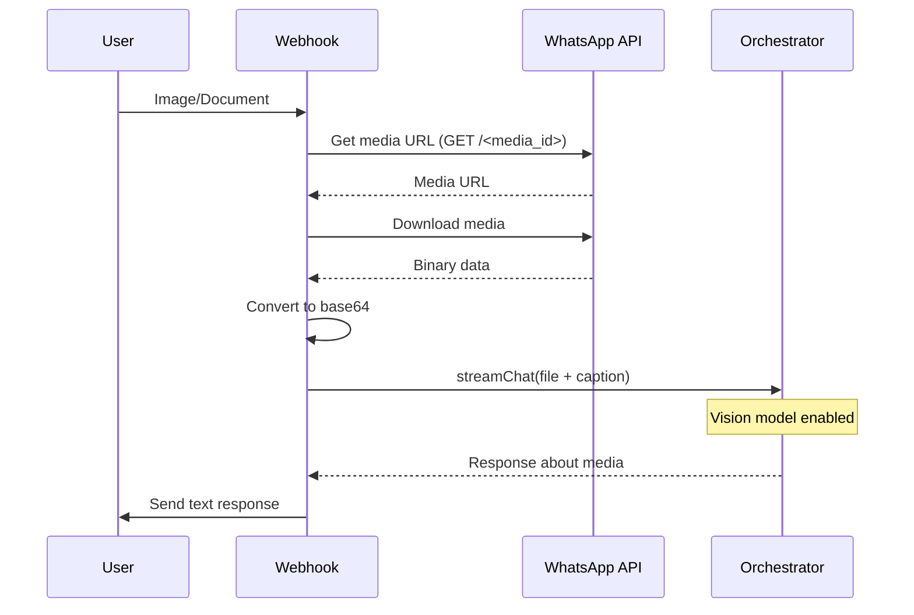
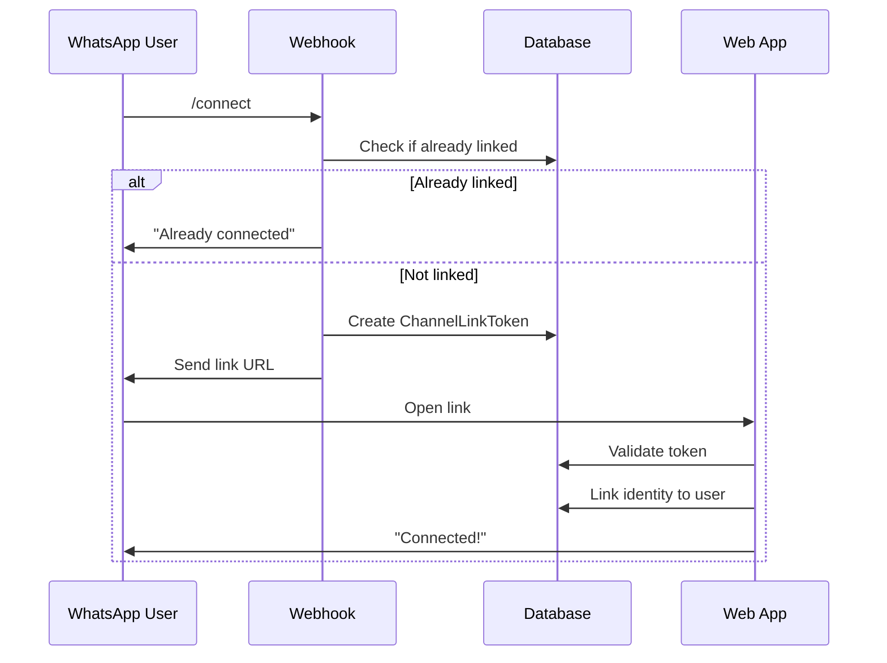

# WhatsApp Webhook

Complete documentation of the WhatsApp Cloud API webhook integration, covering message handling, media processing, user management, and AI integration.

## Overview

The WhatsApp webhook receives updates from the WhatsApp Cloud API, processes user messages (text, voice, photos, documents), and generates AI responses using the orchestrator.



## Endpoint

| Method | Path                     | Description               |
| ------ | ------------------------ | ------------------------- |
| `POST` | `/api/webhooks/whatsapp` | Receives WhatsApp updates |
| `GET`  | `/api/webhooks/whatsapp` | Verification Request      |

### Authentication

The webhook is authenticated in two ways:

1. **Verification (GET)**: Uses `WHATSAPP_VERIFY_TOKEN` (hub.verify_token).
2. **Updates (POST)**: Validates `X-Hub-Signature-256` using `WHATSAPP_APP_SECRET`.

## Message Flow

### Complete Request Lifecycle



## Message Types

### Text Messages



### Audio/Voice Messages



### Image/Document Messages



## User Management

### User Resolution Flow

```mermaid
flowchart TD
    A[Receive Message] --> B{Identity exists?}
    B -->|Yes| C[Get linked User]
    B -->|No| D[Create Guest User]
    D --> E[Create Channel Identity (WHATSAPP)]
    E --> F[Link to Guest User]
    C --> G[Continue processing]
    F --> G
```

### Account Linking (`/connect` command)



## Data Structures

### Payload Structure

```typescript
type WhatsAppPayload = {
	object: "whatsapp_business_account";
	entry: {
		id: string;
		changes: {
			value: {
				messaging_product: "whatsapp";
				metadata: {
					display_phone_number: string;
					phone_number_id: string;
				};
				contacts?: {
					profile: { name: string };
					wa_id: string;
				}[];
				messages?: {
					from: string;
					id: string; // WAMID
					timestamp: string;
					type: "text" | "image" | "audio" | "document";
					text?: { body: string };
					image?: { id: string; caption?: string; mime_type: string };
					audio?: { id: string; mime_type: string };
					document?: {
						id: string;
						caption?: string;
						filename: string;
					};
				}[];
			};
			field: "messages";
		}[];
	}[];
};
```

## Environment Variables

| Variable                   | Required | Description                           |
| -------------------------- | -------- | ------------------------------------- |
| `WHATSAPP_PHONE_NUMBER_ID` | Yes      | Phone Number ID from Meta             |
| `WHATSAPP_ACCESS_TOKEN`    | Yes      | System User Access Token              |
| `WHATSAPP_APP_SECRET`      | Yes      | App Secret for signature verification |
| `WHATSAPP_VERIFY_TOKEN`    | Yes      | Custom token for webhook verification |
| `WHATSAPP_SYNC_WEBHOOK`    | No       | Run synchronously (dev mode)          |
| `WHATSAPP_DISABLE_AI`      | No       | Disable AI responses                  |
| `WHATSAPP_DISABLE_SEND`    | No       | Disable sending messages              |

## Webhook Setup

1. Go to **WhatsApp Manager** > **Configuration**.
2. Click **Edit** callback URL.
3. Enter URL: `https://your-domain.com/api/webhooks/whatsapp`.
4. Enter Verify Token: matches `WHATSAPP_VERIFY_TOKEN`.
5. Subscribe to fields: `messages`.
