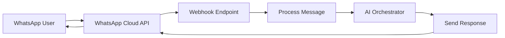
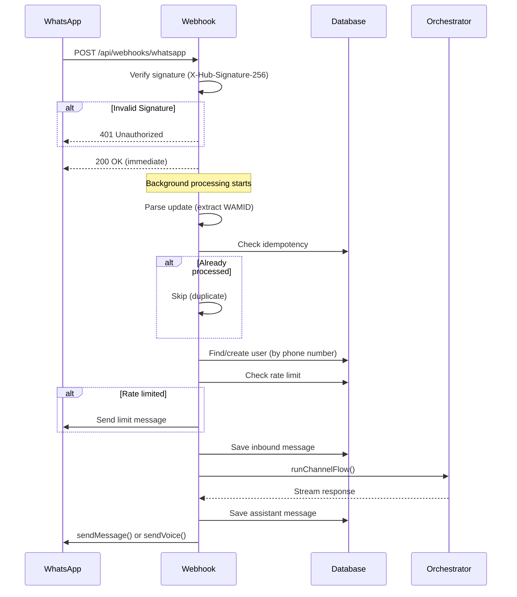
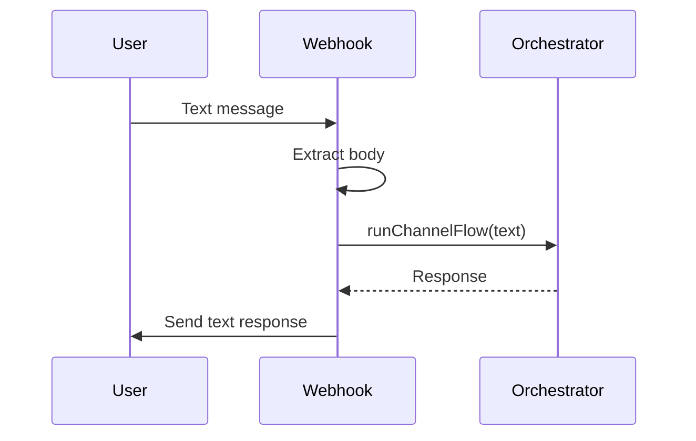
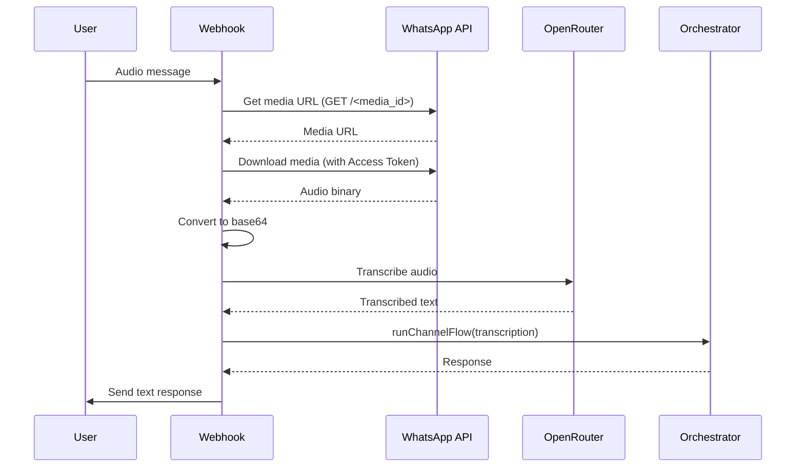
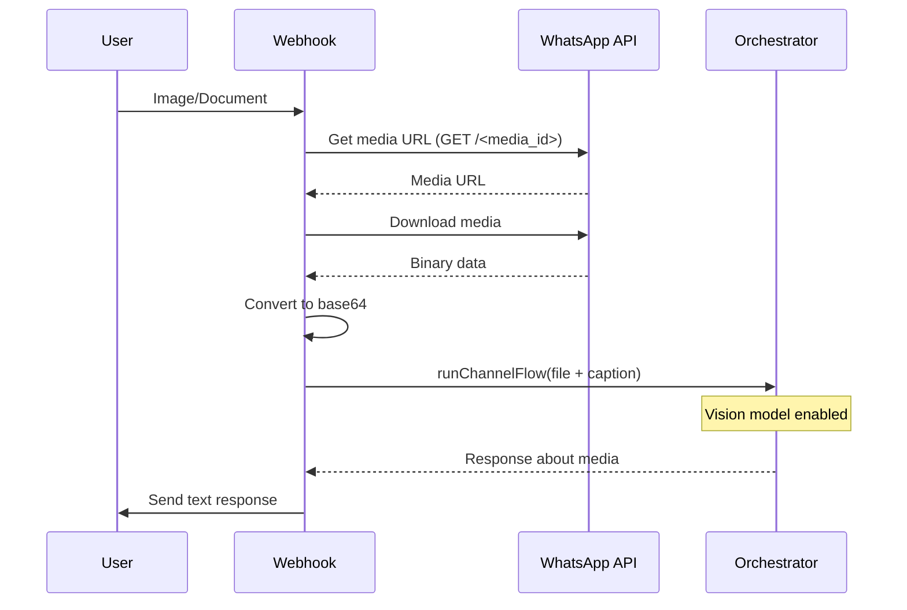
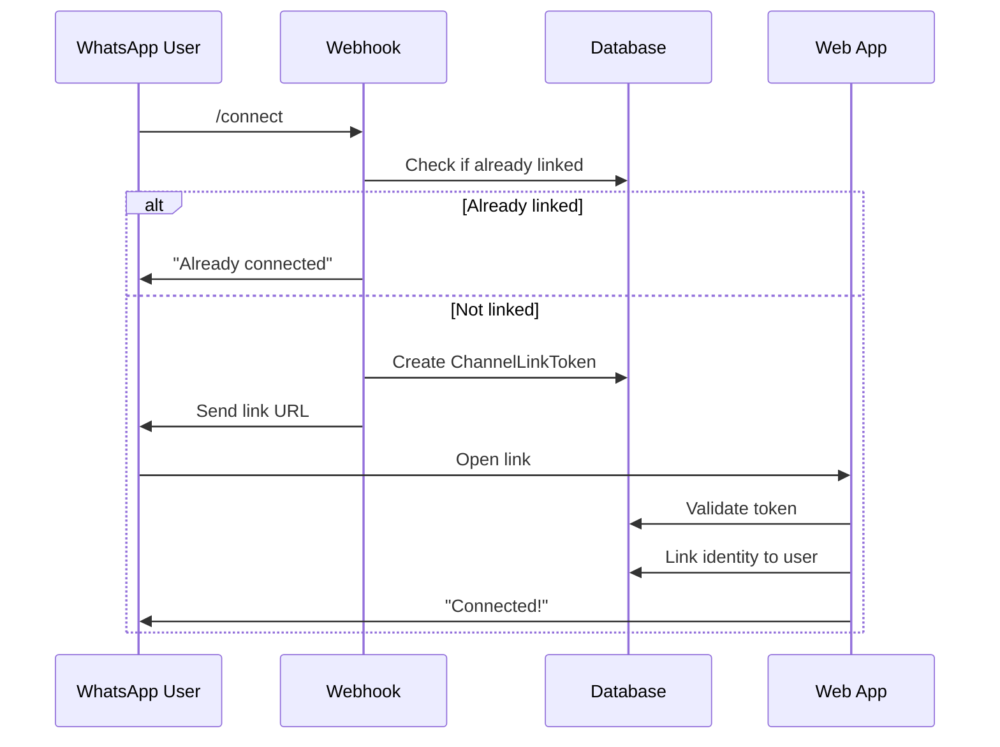

# WhatsApp Webhook

Complete documentation of the WhatsApp Cloud API webhook integration, covering message handling, media processing, user management, and AI integration.

## Overview

The WhatsApp webhook receives updates from the WhatsApp Cloud API, processes user messages (text, voice, photos, documents), and delegates generation/persistence to the shared `runChannelFlow()` runtime.


```mermaid
flowchart LR
    A[WhatsApp User] --> B[WhatsApp Cloud API]
    B --> C[Webhook Endpoint]
    C --> D[Process Message]
    D --> E[AI Orchestrator]
    E --> F[Send Response]
    F --> B
    B --> A
```

## Endpoint

| Method | Path                     | Description               |
| ------ | ------------------------ | ------------------------- |
| `POST` | `/api/webhooks/whatsapp` | Receives WhatsApp updates |
| `GET`  | `/api/webhooks/whatsapp` | Verification Request      |

### Authentication

The webhook is authenticated in two ways:

1. **Verification (GET)**: Uses `WHATSAPP_VERIFY_TOKEN` (hub.verify_token).
2. **Updates (POST)**: Validates `X-Hub-Signature-256` using `WHATSAPP_APP_SECRET`.

POST verification fails closed: an unset `WHATSAPP_APP_SECRET`, a missing signature header, or a mismatched HMAC returns `401 Unauthorized`.

## Message Flow

### Complete Request Lifecycle


```mermaid
sequenceDiagram
    participant WA as WhatsApp
    participant WH as Webhook
    participant DB as Database
    participant AI as Orchestrator

    WA->>WH: POST /api/webhooks/whatsapp
    WH->>WH: Verify signature (X-Hub-Signature-256)

    alt Invalid Signature
        WH-->>WA: 401 Unauthorized
    end

    WH-->>WA: 200 OK (immediate)

    Note over WH: Background processing starts

    WH->>WH: Parse update (extract WAMID)
    WH->>DB: Check idempotency

    alt Already processed
        WH->>WH: Skip (duplicate)
    end

    WH->>DB: Find/create user (by phone number)
    WH->>DB: Check rate limit

    alt Rate limited
        WH->>WA: Send limit message
    end

    WH->>DB: Save inbound message
    WH->>AI: runChannelFlow()
    AI-->>WH: Stream response
    WH->>DB: Save assistant message
    WH->>WA: sendMessage() or sendVoice()
```

## Message Types

### Text Messages


```mermaid
sequenceDiagram
    participant U as User
    participant WH as Webhook
    participant AI as Orchestrator

    U->>WH: Text message
    WH->>WH: Extract body
    WH->>AI: runChannelFlow(text)
    AI-->>WH: Response
    WH->>U: Send text response
```

### Audio/Voice Messages


```mermaid
sequenceDiagram
    participant U as User
    participant WH as Webhook
    participant WA as WhatsApp API
    participant TR as OpenRouter
    participant AI as Orchestrator

    U->>WH: Audio message
    WH->>WA: Get media URL (GET /<media_id>)
    WA-->>WH: Media URL
    WH->>WA: Download media (with Access Token)
    WA-->>WH: Audio binary
    WH->>WH: Convert to base64
    WH->>TR: Transcribe audio
    TR-->>WH: Transcribed text
    WH->>AI: runChannelFlow(transcription)
    AI-->>WH: Response
    WH->>U: Send text response
```

### Image/Document Messages


```mermaid
sequenceDiagram
    participant U as User
    participant WH as Webhook
    participant WA as WhatsApp API
    participant AI as Orchestrator

    U->>WH: Image/Document
    WH->>WA: Get media URL (GET /<media_id>)
    WA-->>WH: Media URL
    WH->>WA: Download media
    WA-->>WH: Binary data
    WH->>WH: Convert to base64
    WH->>AI: runChannelFlow(file + caption)
    Note over AI: Vision model enabled
    AI-->>WH: Response about media
    WH->>U: Send text response
```

### Generated Voice Responses

When ElevenLabs is configured and the personal plan/voice funnel allows it, the handler can synthesize the assistant text, upload the audio, and send a WhatsApp voice message. Organization-selected entitlements are not passed to the current voice-policy call. Otherwise the handler sends text.

## User Management

### User Resolution Flow

```mermaid
flowchart TD
    A[Receive Message] --> B{Identity exists?}
    B -->|Yes| C[Get linked User]
    B -->|No| D[Create Guest User]
    D --> E[Create Channel Identity (WHATSAPP)]
    E --> F[Link to Guest User]
    C --> G[Continue processing]
    F --> G
```

### Account Linking (`/connect` command)


```mermaid
sequenceDiagram
    participant U as WhatsApp User
    participant WH as Webhook
    participant DB as Database
    participant Web as Web App

    U->>WH: /connect
    WH->>DB: Check if already linked

    alt Already linked
        WH->>U: "Already connected"
    else Not linked
        WH->>DB: Create ChannelLinkToken
        WH->>U: Send link URL
        U->>Web: Open link
        Web->>DB: Validate token
        Web->>DB: Link identity to user
        Web->>U: "Connected!"
    end
```

## Data Structures

### Payload Structure

```typescript
type WhatsAppPayload = {
	object: "whatsapp_business_account";
	entry: {
		id: string;
		changes: {
			value: {
				messaging_product: "whatsapp";
				metadata: {
					display_phone_number: string;
					phone_number_id: string;
				};
				contacts?: {
					profile: { name: string };
					wa_id: string;
				}[];
				messages?: {
					from: string;
					id: string; // WAMID
					timestamp: string;
					type: "text" | "image" | "audio" | "voice" | "document" | "unknown";
					text?: { body: string };
					image?: { id: string; caption?: string; mime_type: string };
					audio?: { id: string; mime_type: string };
					document?: {
						id: string;
						caption?: string;
						filename: string;
					};
				}[];
			};
			field: "messages";
		}[];
	}[];
};
```

## Environment Variables

| Variable                   | Required | Description |
| -------------------------- | -------- | ----------- |
| `WHATSAPP_PHONE_NUMBER_ID` | Yes      | Phone-number resource used for delivery. |
| `WHATSAPP_ACCESS_TOKEN`    | Yes      | Meta Graph API authentication. |
| `WHATSAPP_APP_SECRET`      | Yes      | POST signature verification; never leave unset. |
| `WHATSAPP_VERIFY_TOKEN`    | Yes      | GET subscription challenge. |
| `NEXT_PUBLIC_APP_URL`      | Yes for linking | Public base URL for `/link/whatsapp/[token]`. |
| `OPENROUTER_API_KEY`       | Yes for AI/media | Responses and audio transcription. |
| `ELEVENLABS_API_KEY`       | No       | Enables eligible generated voice replies. |
| `ELEVENLABS_VOICE_ID`      | No       | Overrides the default voice. |
| `WHATSAPP_SYNC_WEBHOOK`    | No       | Set `true` to await processing in local debugging. |
| `WHATSAPP_DISABLE_AI`      | No       | Set `true` to disable AI responses. |
| `WHATSAPP_DISABLE_SEND`    | No       | Set `true` to suppress outbound calls. |

Normal AI execution also requires Tavily and server-side PostHog configuration. See [Configuration](./configuration.md).

## Webhook Setup

1. Go to **WhatsApp Manager** > **Configuration**.
2. Click **Edit** callback URL.
3. Enter URL: `https://your-domain.com/api/webhooks/whatsapp`.
4. Enter Verify Token: matches `WHATSAPP_VERIFY_TOKEN`.
5. Subscribe to fields: `messages`.

## Related Files

- `src/app/api/webhooks/whatsapp/route.ts` - Route wrapper
- `src/lib/channels/whatsapp/webhook-handler.ts` - WhatsApp adapter
- `src/lib/channels/whatsapp/utils.ts` - Signature, media, and delivery helpers
- `src/lib/channel-flow/` - Shared generation and assistant persistence
- [API Reference](./api.md)
