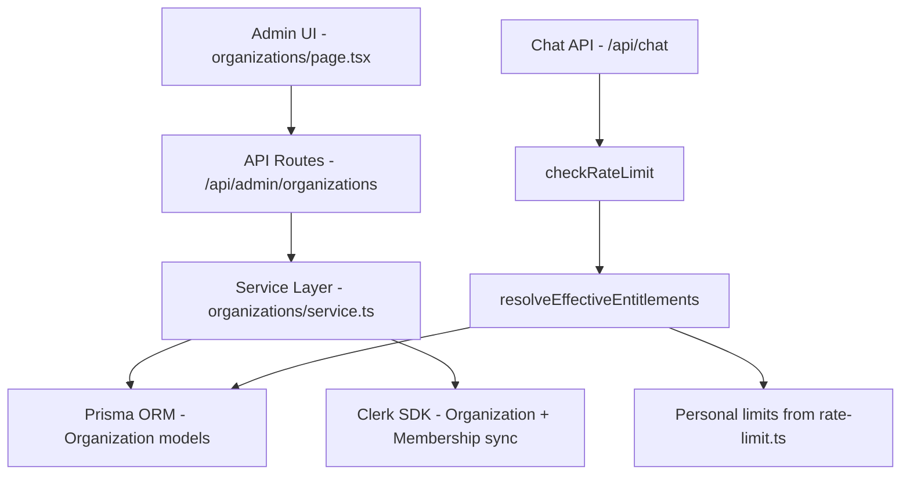
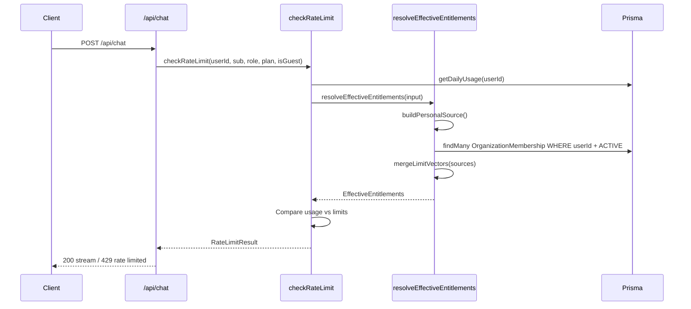
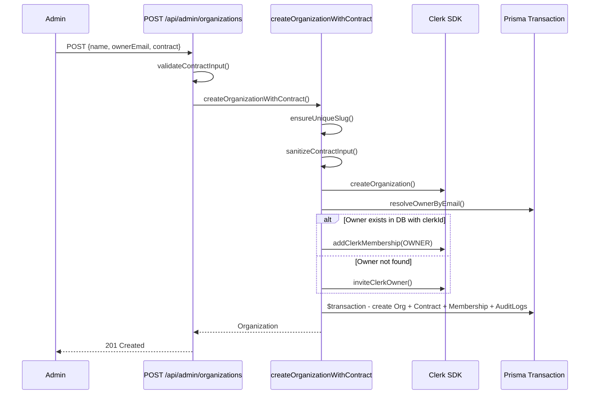

# Comprehensive Architectural Review: Organizations & Entitlements System

**Date:** 2026-02-15  
**Scope:** Organization management, contract-based entitlements, rate-limit integration, admin UI, Clerk sync  
**Files reviewed:**
- `src/lib/organizations/types.ts`
- `src/lib/organizations/entitlements.ts`
- `src/lib/organizations/service.ts`
- `src/lib/rate-limit.ts`
- `src/lib/usage.ts`
- `src/app/api/admin/organizations/route.ts`
- `src/app/api/admin/organizations/[organizationId]/route.ts`
- `src/app/api/admin/organizations/[organizationId]/audit/route.ts`
- `src/app/(admin)/admin/organizations/page.tsx`
- `prisma/migrations/20260215170000_add_organizations_contracts/migration.sql`
- `prisma/schema.prisma`

---

## 1. Architectural Analysis

### 1.1 Overall Design

The change introduces a **B2B organization layer** on top of the existing per-user subscription model. The architecture follows a clean three-tier pattern:

**Strengths:**
- Clear separation between API validation, business logic (service), and data access (Prisma)
- The entitlements module acts as a **merge layer** that combines personal and organization limits using a "highest wins" strategy — a sound design for B2B upsell
- Audit logging is baked into every mutation, not bolted on as an afterthought
- Clerk integration is abstracted behind helper functions, making it testable and swappable

**Concerns:**
- The `src/lib/organizations/` module is well-isolated, but `src/lib/rate-limit.ts` now has **duplicated limit constants** — the `RATE_LIMITS` map in rate-limit.ts and `PERSONAL_LIMITS` in entitlements.ts contain identical values. This violates **DRY** and will drift over time.

### 1.2 Modularity & Separation of Concerns

| Layer | Responsibility | Assessment |
|-------|---------------|------------|
| `types.ts` | Shared type definitions, enums, interfaces | ✅ Clean, single-purpose |
| `entitlements.ts` | Merge personal + org limits | ✅ Pure logic + single DB query |
| `service.ts` | CRUD, Clerk sync, audit logging | ⚠️ Large file (950+ lines), could benefit from splitting |
| API routes | Validation, auth, HTTP concerns | ✅ Thin controllers |
| Admin UI | Form management, API calls | ⚠️ Single 500+ line component |

### 1.3 SOLID Compliance

- **S (Single Responsibility):** `service.ts` handles creation, updates, Clerk sync, membership sync, and audit logging — it's doing too much. Consider extracting `clerk-sync.ts` and `membership-sync.ts`.
- **O (Open/Closed):** The entitlements merge strategy is extensible — adding new source types only requires adding to the `sources` array.
- **L (Liskov):** N/A — no inheritance hierarchies.
- **I (Interface Segregation):** ✅ `OrganizationContractInput` is well-scoped.
- **D (Dependency Inversion):** The Clerk SDK is accessed through wrapper functions, but they're not injected — making unit testing harder.

### 1.4 Scalability Implications

- The entitlements query in [`resolveEffectiveEntitlements()`](src/lib/organizations/entitlements.ts:207) runs on **every chat request**. It queries `OrganizationMembership` joined with `Organization` and `OrganizationContract`. With proper indexes (present in migration), this should be fast, but at scale it should be **cached** (e.g., 60-second TTL per userId).
- The `syncMembershipFromClerkEvent()` uses **Serializable isolation** with retry — correct for seat-limit enforcement but expensive under high webhook volume.

---

## 2. Code Flow Analysis

### 2.1 Chat Request → Entitlements Resolution

**Key observations:**
- Two DB queries per chat request for rate limiting: `getDailyUsage` + `findMany memberships`
- The `checkRateLimit` function now delegates to `resolveEffectiveEntitlements` for limits but still has its own `getRateLimitsForUser()` function that is **no longer used in the hot path** — it's only used by the orphaned `_getRemainingAllowance()` helper (prefixed with `_`).

### 2.2 Organization Creation Flow

**Risk:** Clerk operations happen **before** the DB transaction. If the transaction fails, the Clerk organization exists but the DB record doesn't. There's no compensation logic for the `createOrganizationWithContract` path (unlike `updateOrganization` which has compensation).

### 2.3 Membership Sync from Clerk Webhook

The [`syncMembershipFromClerkEvent()`](src/lib/organizations/service.ts:763) flow is the most complex:
1. Resolves organization and user in parallel
2. Runs a **Serializable transaction** with up to 3 retries
3. Upserts membership, writes audit log
4. If ACTIVE and over seat limit → blocks membership, removes from Clerk
5. If OWNER role → demotes previous owner, updates organization

This is well-designed for consistency but the **Serializable isolation + retry** pattern means webhook processing can be slow under contention.

---

## 3. Code Quality Assessment

### 3.1 Naming & Readability

| Item | Assessment |
|------|-----------|
| Function names | ✅ Descriptive: `resolveEffectiveEntitlements`, `syncMembershipFromClerkEvent` |
| Variable names | ✅ Clear: `seatLimit`, `contractPatch`, `ownerTransfer` |
| Underscore-prefixed functions | ⚠️ `_getAttachmentRetentionDays`, `_getRemainingAllowance`, `_formatRateLimitStatus` — these appear unused. Should be removed or exported. |
| Type safety | ✅ Strong typing throughout with `as const` arrays and derived types |

### 3.2 Duplicated Logic

**Critical DRY violation:** Rate limit constants are defined in two places:

1. [`RATE_LIMITS`](src/lib/rate-limit.ts:25) in `rate-limit.ts`
2. [`PERSONAL_LIMITS`](src/lib/organizations/entitlements.ts:18) in `entitlements.ts`

These are **identical maps** with the same values. The `checkRateLimit()` function now uses `resolveEffectiveEntitlements()` which reads from `PERSONAL_LIMITS`, making `RATE_LIMITS` in rate-limit.ts effectively dead code for the main flow.

**Duplicated validation:** Contract input validation exists in three places:
1. [`sanitizeContractInput()`](src/lib/organizations/service.ts:45) in service.ts
2. [`validateContractInput()`](src/app/api/admin/organizations/route.ts:13) in the POST route
3. [`validateContractPatch()`](src/app/api/admin/organizations/[organizationId]/route.ts:27) in the PATCH route

The route-level validation is appropriate for HTTP concerns, but the service-level `sanitizeContractInput()` re-validates the same constraints. Consider having routes validate and service trust the input.

### 3.3 Error Handling

- ✅ All API routes have try/catch with proper HTTP status codes
- ✅ Clerk failures are caught and logged
- ✅ Serialization failures trigger retries
- ⚠️ The `createOrganizationWithContract` function doesn't compensate for Clerk org creation if the DB transaction fails (unlike `updateOrganization` which does)
- ⚠️ Error messages from `service.ts` are passed directly to the client in the POST/PATCH routes — this could leak internal details

### 3.4 Dead Code

Several functions in `rate-limit.ts` are prefixed with `_` indicating they're unused:
- [`_getAttachmentRetentionDays()`](src/lib/rate-limit.ts:106) — has a public constant `ATTACHMENT_RETENTION_DAYS` but the function is private/unused
- [`_getRemainingAllowance()`](src/lib/rate-limit.ts:578) — calls `getRateLimitsForUser()` which doesn't account for org entitlements
- [`_formatRateLimitStatus()`](src/lib/rate-limit.ts:605) — unused UI helper

Additionally, [`getRateLimitsForUser()`](src/lib/rate-limit.ts:522) is exported but may no longer be needed since `checkRateLimit()` now uses `resolveEffectiveEntitlements()`.

### 3.5 Test Coverage

No test files were found for the organizations module. Given the complexity of:
- Entitlements merging logic
- Seat limit enforcement
- Owner transfer flows
- Clerk compensation logic

This is a significant gap.

---

## 4. Real-World Use Case Evaluation

### 4.1 Happy Path: Organization Member Chats

A user belonging to an organization with an Enterprise contract gets the **higher of** their personal limits and org limits. This works correctly via [`mergeLimitVectors()`](src/lib/organizations/entitlements.ts:150) which takes `Math.max()` across all sources.

### 4.2 Multi-Organization Membership

A user in **multiple organizations** gets the best limits from any of them. This is handled correctly — all active memberships are queried and merged.

### 4.3 Seat Limit Enforcement

When a Clerk webhook fires for a new membership and the org is at capacity:
1. Membership is created as BLOCKED
2. Clerk membership is removed
3. Audit log records the block

**Edge case concern:** If the Clerk removal fails (line 918-930), the error is thrown but the DB already has the membership as BLOCKED. The user won't get org entitlements (status != ACTIVE), but they'll appear as a blocked member in the admin UI. This is acceptable degraded behavior.

### 4.4 Owner Transfer

Owner transfer during update:
1. New owner is added to Clerk
2. DB transaction: update contract, demote old owner, promote new owner, audit log
3. Old owner is demoted in Clerk (best-effort, errors caught)

**If step 2 fails:** Compensation removes the new Clerk membership. ✅ Good.
**If step 3 fails:** Old owner keeps admin role in Clerk but is demoted in DB. This inconsistency is logged but not resolved automatically.

### 4.5 Network Failures & Partial Outages

- **Clerk down during org creation:** Fails fast with error. No DB records created. ✅
- **DB down during org creation:** Clerk org exists but no DB record. ❌ No compensation.
- **Clerk down during membership sync:** Webhook will be retried by Clerk. ✅
- **DB down during rate limit check:** Chat request fails with 500. Acceptable.

### 4.6 Documentation Drift

The [`docs/rate-limiting.md`](docs/rate-limiting.md) shows different values than the code:
- Doc says TRIAL has 50 requests/day, code says 3
- Doc says basic has 200 requests/day, code says 50

The documentation is **stale** and doesn't mention organization-level entitlements at all.

---

## 5. Potential Issues & Risk Assessment

### Priority: 🔴 Critical

| # | Issue | Details | Remediation |
|---|-------|---------|-------------|
| 1 | **No compensation for Clerk org on DB failure** | [`createOrganizationWithContract()`](src/lib/organizations/service.ts:319) creates a Clerk org before the DB transaction. If the transaction fails, a phantom Clerk org exists. | Add try/catch around the transaction that deletes the Clerk org on failure, similar to the pattern in `updateOrganization()`. |
| 2 | **Duplicated rate limit constants** | `RATE_LIMITS` in rate-limit.ts and `PERSONAL_LIMITS` in entitlements.ts are identical. Changes to one won't propagate. | Extract a single `PLAN_LIMITS` constant in `types.ts` or a shared config, import in both modules. |
| 3 | **No test coverage** | Zero tests for entitlements merging, seat enforcement, owner transfer, or Clerk compensation. | Add unit tests for `entitlements.ts` pure functions and integration tests for `service.ts` flows. |

### Priority: 🟡 High

| # | Issue | Details | Remediation |
|---|-------|---------|-------------|
| 4 | **Entitlements query on every chat request** | [`resolveEffectiveEntitlements()`](src/lib/organizations/entitlements.ts:207) hits the DB on every request. For users with no org memberships, this is a wasted query. | Add a short-lived cache (e.g., `unstable_cache` or in-memory LRU with 30-60s TTL). |
| 5 | **Documentation drift** | [`docs/rate-limiting.md`](docs/rate-limiting.md) shows incorrect limit values and doesn't mention organizations. | Update docs to reflect current values and add organization entitlements section. |
| 6 | **Error message leakage** | Service-layer errors (e.g., "Invalid planPreset") are passed to clients in API routes. | Sanitize error messages at the API layer; log full errors server-side. |
| 7 | **`personalPlanKeyToTier()` maps GUEST and ACTIVE to TRIAL** | In [`personalPlanKeyToTier()`](src/lib/organizations/entitlements.ts:111), both GUEST and ACTIVE fall through to the default "TRIAL" tier. ACTIVE users should map to "BASIC" at minimum. | Add explicit cases for "GUEST" → "TRIAL" and "ACTIVE" → "BASIC". |

### Priority: 🟢 Medium

| # | Issue | Details | Remediation |
|---|-------|---------|-------------|
| 8 | **Large service file** | `service.ts` is 950+ lines handling creation, updates, sync, and audit. | Split into `organization-crud.ts`, `clerk-sync.ts`, `membership-sync.ts`. |
| 9 | **Admin UI is a single large component** | `organizations/page.tsx` is 500+ lines with all state in one component. | Extract `OrganizationList`, `OrganizationForm`, `AuditLogPanel` components. |
| 10 | **Dead code in rate-limit.ts** | `_getAttachmentRetentionDays()`, `_getRemainingAllowance()`, `_formatRateLimitStatus()`, and potentially `getRateLimitsForUser()` are unused or redundant. | Remove dead code or mark as deprecated with migration plan. |
| 11 | **Inconsistent plan key casing** | Personal plans use mixed case (`basic`, `basic_plus`, `GUEST`, `TRIAL`, `ADMIN`). Org tiers use all-caps (`BASIC`, `BASIC_PLUS`). | Standardize to one convention. |
| 12 | **`ensureUniqueSlug()` has 100 DB queries worst case** | The slug uniqueness check loops up to 100 times with individual queries. | Use a single query with `LIKE` pattern or add a random suffix on first collision. |
| 13 | **No rate limiting on admin API routes** | Organization CRUD endpoints have auth but no rate limiting. An admin could accidentally trigger rapid-fire requests. | Add basic rate limiting or debounce on admin endpoints. |
| 14 | **Clerk SDK abstraction is fragile** | [`callClerkMethod()`](src/lib/organizations/service.ts:121) tries multiple method names to handle SDK version differences. This is clever but brittle. | Pin the Clerk SDK version and use direct method calls, or add SDK version detection. |

### Priority: ⚪ Low

| # | Issue | Details | Remediation |
|---|-------|---------|-------------|
| 15 | **`Infinity` in percent calculations** | When limits are `POSITIVE_INFINITY` (admin), `percentUsed` calculations produce `0` (0/Infinity), which is correct but could confuse UI consumers. | Document this behavior or return `0` explicitly for admin users. |
| 16 | **Italian-only CTA messages** | [`getUpgradeInfo()`](src/lib/rate-limit.ts:260) has hardcoded Italian strings. | Move to i18n system if multi-language support is planned. |
| 17 | **No pagination on organization list** | [`listOrganizations()`](src/lib/organizations/service.ts:289) fetches all orgs. Fine for now but won't scale past hundreds. | Add cursor-based pagination when needed. |

---

## 6. Summary & Recommended Action Items

The organizations feature is **architecturally sound** with good separation of concerns, proper audit logging, and a well-designed entitlements merge strategy. The main risks are:

1. **Immediate:** Fix the Clerk compensation gap in `createOrganizationWithContract()` and consolidate duplicated limit constants
2. **Before production:** Add test coverage for the entitlements and membership sync logic
3. **Soon after:** Cache entitlements resolution, update documentation, clean up dead code
4. **Ongoing:** Split large files, standardize naming conventions, improve error sanitization

The `mergeLimitVectors()` "highest wins" approach is the right call for B2B — it ensures organization members always get at least their personal entitlements, and org contracts can only upgrade, never downgrade. This is a clean, defensible design.
